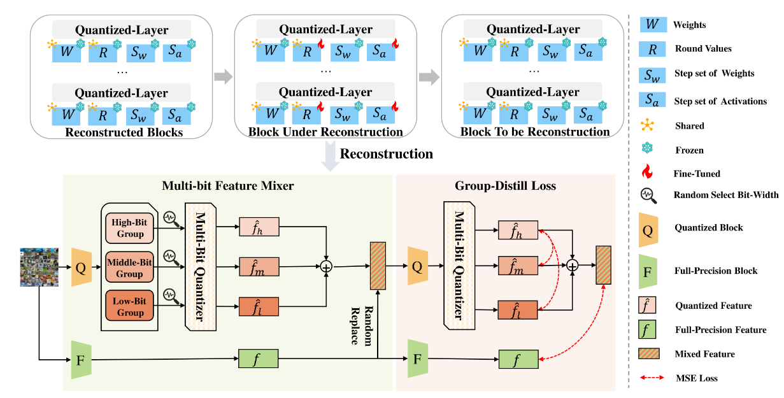
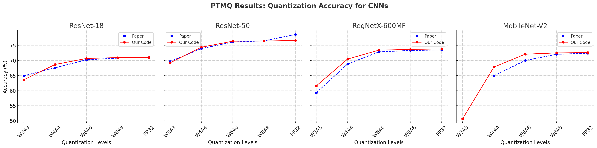

<div align="center">

</div>

# PTMQ-PyTorch

PyTorch implementation of **[PTMQ: Post-training Multi-Bit Quantization of Neural Networks](https://ojs.aaai.org/index.php/AAAI/article/view/29553)**, presented at [AAAI 2024](https://aaai.org/conference/aaai/aaai-24/).

---

## Highlights

PTMQ introduces a novel approach to multi-bit quantization with key innovations:

- **Fast Calibration:** A 100x speedup in multi-bit quantization, with minimal data requirements.
- **Dynamic Bit-Width Adaptation:** Seamless bit-width changes enabled by norm layer fusion.
- **Multi-Bit Feature Mixer (MFM):** Robust feature fusion across bit-widths for improved performance.
- **Group-wise Distillation Loss (GD-Loss):** Enhances feature correlation, yielding superior low-bit and high-bit accuracy.

---

## Installation

Ensure Python 3.10 is installed along with the required dependencies:

```bash
pip install torch torchvision timm
```

---

## Getting Started

### Directory Structure

The repository is organized as follows:

```bash
ptmq-pytorch/
├── config/            # Configuration files for models
├── imgs/              # Images for README
├── model/             # Model and QuantBlock definitions
├── quant/             # Quantization utilities
├── scripts/           # Shell scripts for running experiments
├── utils/             # Utility functions
├── run_ptmq.py        # Main script for PTMQ
└── README.md          # Repository README
```

### Dataset

PTMQ supports post-training quantization using minimal calibration data (up to 1024 images from the training set). The datasets used include:

| Dataset    | Source                                                                           |
|------------|----------------------------------------------------------------------------------|
| Train Data | [mini-Imagenet](https://www.kaggle.com/datasets/zcyzhchyu/mini-imagenet)         |
| Test Data  | [Official ImageNet-1K validation data](https://www.image-net.org/index.php)      |

### Model Support

This repository supports a wide range of CNNs and Vision Transformers:

| Category                | Model        | Variants                                                |
|-------------------------|--------------|---------------------------------------------------------|
| **CNNs**                | ResNet       | ResNet-18, ResNet-34, ResNet-50, ResNet-101, ResNet-152 |
|                         | MobileNetV2  | -                                                       |
|                         | RegNetX      | RegNetX-600MF (and 15 others)                           |
| **Vision Transformers** | ViT          | ViT-S/224/16, ViT-B/224/16                              |
|                         | DeiT         | DeiT-S/224/16, DeiT-B/224/16                            |

To add custom models:
- Modify `utils/model_utils.py` to integrate quantization blocks.
- Add a corresponding configuration file in the `configs` directory.

---

## Usage

### Post-Training Quantization

Perform quantization from scratch:

```bash
python run_ptmq.py --model resnet18 --w_bit 4 --a_bit 4 \
                   --a_bit_low 6 --a_bit_med 7 --a_bit_high 8 \
                   --scale_lr 4e-3 --recon_iter 5000
```

Alternatively, create a configuration file in the `configs` directory and specify desired settings.

### Results

PTMQ replicates high-accuracy results without requiring mixed-precision quantization:

<div align="center">

</div>

| Model         | Benchmark       | W3A3  | W4A4  | W6A6  | W8A8  | FP32  |
|---------------|-----------------|-------|-------|-------|-------|-------|
| ResNet-18     | PTMQ (Paper)    | 64.92 | 67.57 | 70.23 | 70.79 | 71.00 |
|               | PTMQ (Our Code) | 63.60 | 68.67 | 70.67 | 70.96 | 71.00 |
| ResNet-50     | PTMQ (Paper)    | 69.67 | 73.93 | 76.11 | 76.52 | 76.80 |
|               | PTMQ (Our Code) | 69.21 | 74.40 | 76.39 | 76.46 | 76.62 |
| MobileNet-V2  | PTMQ (Paper)    |   -   | 64.94 | 70.00 | 72.05 | 72.40 |
|               | PTMQ (Our Code) | 50.65 | 67.81 | 72.09 | 72.51 | 72.62 |

See `scripts/run_cnn.sh` and not mentioned hyperparemeters in `configs/resnet18.yaml` for more details. Hyperparameters are not released and the current results are based on our implementation.

---

## Tips & Tricks

- **Observer Optimization:** Use `MinMaxObserver` for faster calibration compared to `MSEObserver`.
- **Transforms:** Ensure proper transforms for models (e.g., `timm`-specific transforms).
- **Bit-Precision Settings:** Configure low/mid/high bit-widths for optimal performance (e.g., W4A6 assumes low=6, mid=7, high=8). These are not released, so experiment with different settings.

---

## References

- [PTMQ: Post-training Multi-Bit Quantization of Neural Networks](https://ojs.aaai.org/index.php/AAAI/article/view/29553)
- [QDrop: Random Dropout for Quantization](https://github.com/wimh966/QDrop)

---

## License

This repository is released under the [MIT License](https://github.com/d7chong/ptmq-pytorch/blob/master/LICENSE).

---
